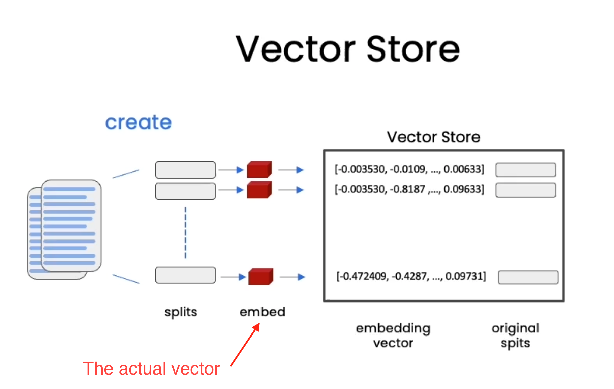
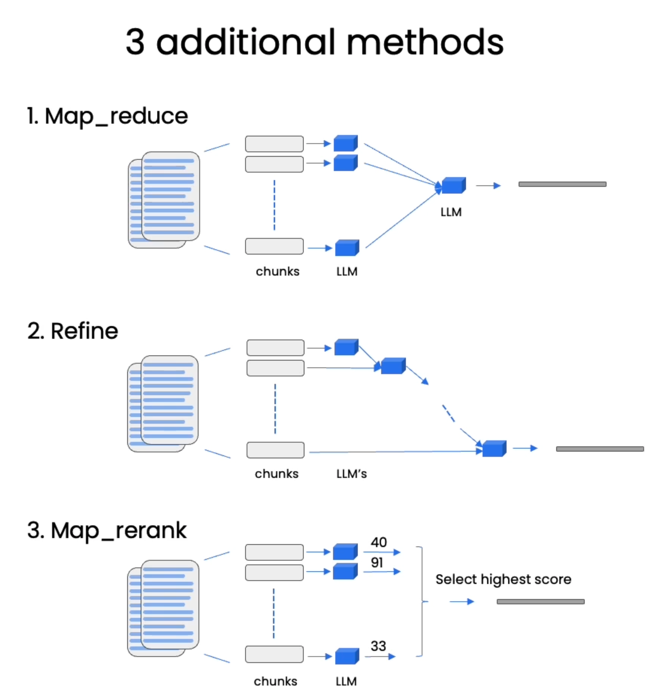
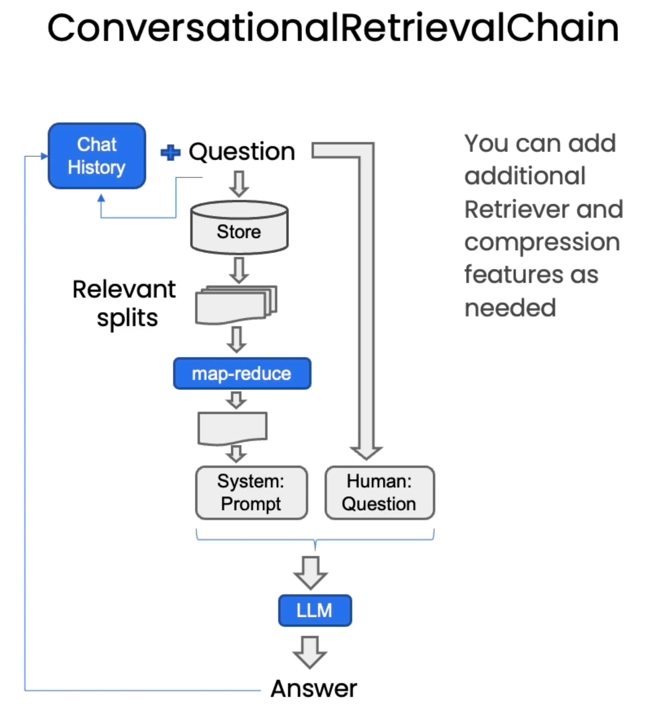

# Chapter 3: Embedding and Vector Stores

# Chapter 5: Question Answering with Retrieval
If we do not fit into the context window of the LLM after retrieval of documents/chunks/embeddings, here are some strategies to handle that:

# Chapter 6: Chat with Your Data
We can use any of the retrieval strategies mentioned above to build a chat application over our data (map reduce, refine, stuff, etc).
